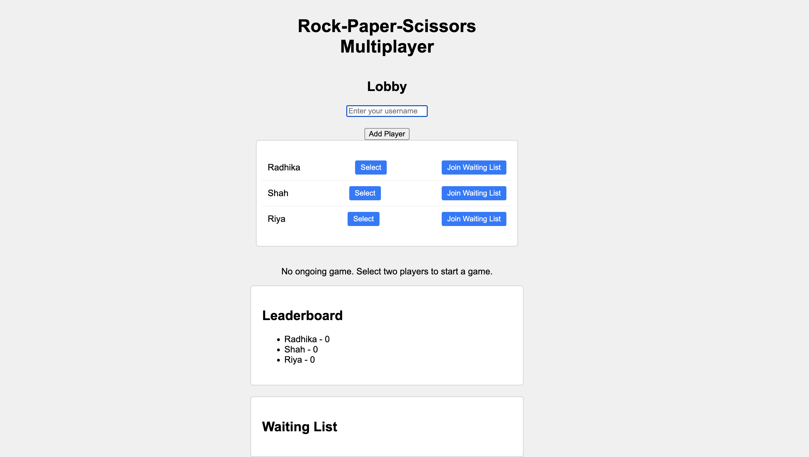
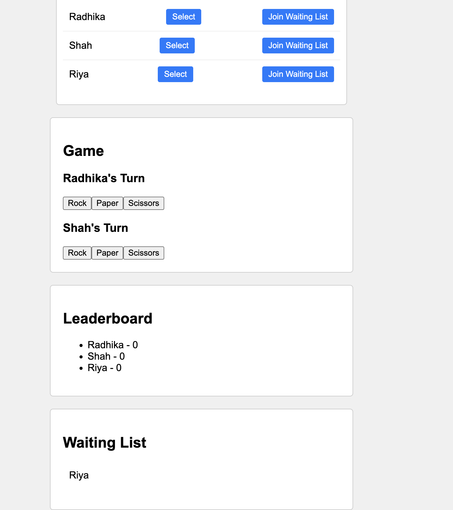

# Multiplayer Rock-Paper-Scissors Game

## Introduction

This project is a web-based multiplayer Rock-Paper-Scissors game where multiple players can play against each other in the same browser but with different tabs. Players are identified by unique usernames, and their scores are visible to all participants. The game includes a leaderboard to display user rankings and a waiting list for new players to join if two players are already engaged in a game.

## Features

- **User Authentication**: Players can enter unique usernames to identify themselves.
- **Game Lobby**: Displays a list of available players and a "Play" button next to each available player to initiate a game.

- **Gameplay**: Implements the Rock-Paper-Scissors game logic:
  - Rock beats scissors
  - Scissors beats paper
  - Paper beats rock
  - Displays the choices of both players and the result (win, lose, or draw).
  
- **Leaderboard**: Shows the usernames and scores of all players and updates in real-time as scores change.

- **Waiting List**: Allows players to join a waiting list if two players are already playing and prompts the waiting player to start a game when one of the ongoing games finishes.
- **Responsive Design**: Ensures the game works well on different screen sizes.

## Technologies Used

- **HTML**: For structuring the web pages.
- **CSS**: For styling the web pages and ensuring responsive design.
- **JavaScript**: For implementing game logic and interactivity.
- **React.js**: For building the user interface components and managing the application state.

## Components

### 1. App.js

This is the main component that manages the state of the game, including the list of players, the current game, the waiting list, and the leaderboard. It handles adding players, starting games, and ending games.

### 2. Lobby.js

Displays the list of available players in the lobby, allows adding new players, joining the waiting list, and starting a game.

### 3. Game.js

Handles the gameplay logic where two players select their choices (rock, paper, or scissors), and the game determines the winner.

### 4. Leaderboard.js

Displays the leaderboard with usernames and scores of all players, updating in real-time as scores change.

### 5. WaitingList.js

Shows the list of players in the waiting list who are waiting to join a game.

## Setup Instructions

1. **Clone the repository**:
git clone https://github.com/radhikashah0499/Rock-scissors-paper.git

2. **Navigate to the project directory**:
cd Rock-scissors-paper/rock-paper-scissors

3. **Install dependencies**:
npm install

4. **Start the development server**:
npm start

5. **Open your browser and navigate to**:
http://localhost:3000

 
## How to Play

1. **Add Players**: Enter unique usernames to add players to the game lobby.
2. **Join Waiting List**: Players in the lobby can join the waiting list by clicking the "Join Waiting List" button.
3. **Start Game**: When there are at least two players in the waiting list, click "Start Game" to initiate the game between the first two players in the list.
4. **Make Choices**: Each player selects their choice (rock, paper, or scissors) in the game screen.
5. **View Results**: The game displays the choices of both players and the result (win, lose, or draw). Scores are updated accordingly.
6. **Leaderboard**: Check the leaderboard to see the rankings of all players based on their scores.
7. **Waiting List**: Players not currently playing can join the waiting list and wait for their turn to play.

## Responsive Design

The game is designed to be responsive and works well on different screen sizes. The layout adjusts to ensure a seamless user experience on both desktop and mobile devices.

